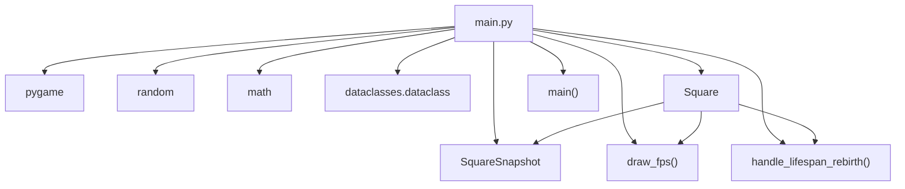
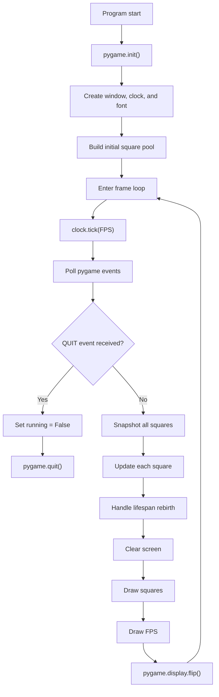
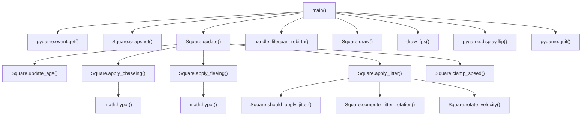
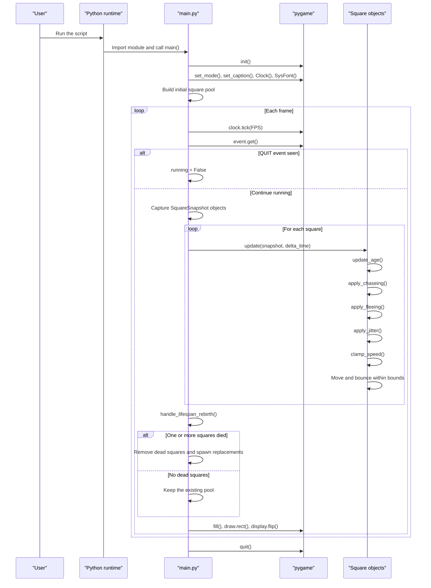

# Architecture Overview

This project is a single-module Pygame application. The core behavior lives in `main.py`, where the game initializes Pygame, creates a pool of moving squares, then runs a frame loop that updates motion, applies fleeing and jitter, handles lifespan rebirth, and renders the scene.

## Module Dependency Graph

Because the codebase currently centers on one executable module, this graph shows the internal structure inside `main.py` and its external library dependencies.

## Runtime Flow

The main loop polls events, snapshots square state, updates every square, replaces dead squares, and then renders the frame.

## Function Call Graph

The call graph highlights the main control path and the methods that shape each square's behavior.

## Sequence Diagram

This sequence shows the primary execution path, including the per-frame loop and the branch that replaces dead squares.

## Notes

- The project currently has one source file, so the architecture is intentionally compact.
- `SquareSnapshot` exists to keep fleeing and chasing decisions stable within a frame.
- Lifespan rebirth keeps the number of squares constant even when individual squares expire.
